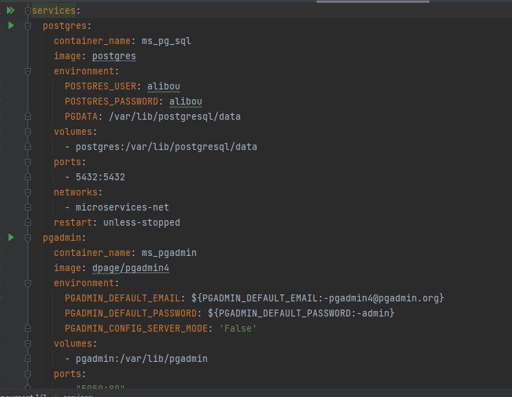
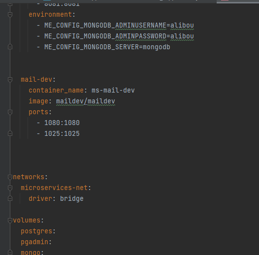

# Customer Service Application

## Description
Cette application est un service backend pour gérer les informations des clients dans un contexte de commerce électronique. Elle utilise MongoDB comme base de données et est déployée avec Docker via un fichier `docker-compose`. Le projet est structuré suivant une architecture en couches avec des contrôleurs, des services, des repositories, et des mappers.

## Structure du projet
Voici un aperçu de l'arborescence du projet :

customer/ │ ├── src/ │ └── main/ │ └── java/ │ └── com.tall.ecommerce/ │ ├── controller/ # Contient les contrôleurs REST │ ├── customer/ # Entités et classes liées aux clients │ ├── exception/ # Gestion des exceptions │ ├── handler/ # Handlers pour la gestion des erreurs globales │ ├── mapper/ # Mappers pour transformer les entités et DTO │ ├── repository/ # Repositories pour l'accès à la base de données MongoDB │ └── service/ # Services contenant la logique métier └─── resources/ └── application.yml # Configuration de l'application

## Technologies utilisées
- **Java** avec **Spring Boot** pour le développement backend
- **MongoDB** pour la base de données
- **Docker** et **Docker Compose** pour le déploiement et l'orchestration de services
- **Lombok** pour réduire le boilerplate dans le code
- **Maven** comme outil de gestion de projet

## Prérequis
Avant de démarrer, assurez-vous d'avoir les éléments suivants installés :
- [Docker](https://www.docker.com/)
- [Docker Compose](https://docs.docker.com/compose/)
- [JDK 17](https://www.oracle.com/java/technologies/javase/jdk17-archive-downloads.html)
- [Maven](https://maven.apache.org/)

### Reference Documentation
For further reference, please consider the following sections:

* [Official Apache Maven documentation](https://maven.apache.org/guides/index.html)
* [Spring Boot Maven Plugin Reference Guide](https://docs.spring.io/spring-boot/docs/3.0.2/maven-plugin/reference/html/)
* [Create an OCI image](https://docs.spring.io/spring-boot/docs/3.0.2/maven-plugin/reference/html/#build-image)
* [Spring Data MongoDB](https://docs.spring.io/spring-boot/docs/3.0.2/reference/htmlsingle/#data.nosql.mongodb)
* [Eureka Discovery Client](https://docs.spring.io/spring-cloud-netflix/docs/current/reference/html/#service-discovery-eureka-clients)
* [Spring Web](https://docs.spring.io/spring-boot/docs/3.0.2/reference/htmlsingle/#web)
* [Config Client Quick Start](https://docs.spring.io/spring-cloud-config/docs/current/reference/html/#_client_side_usage)

### Guides
The following guides illustrate how to use some features concretely:

* [Accessing Data with MongoDB](https://spring.io/guides/gs/accessing-data-mongodb/)
* [Service Registration and Discovery with Eureka and Spring Cloud](https://spring.io/guides/gs/service-registration-and-discovery/)
* [Building a RESTful Web Service](https://spring.io/guides/gs/rest-service/)
* [Serving Web Content with Spring MVC](https://spring.io/guides/gs/serving-web-content/)
* [Building REST services with Spring](https://spring.io/guides/tutorials/rest/)

## Installation et démarrage du projet

### Étape 1 : Cloner le dépôt
Clonez ce dépôt sur votre machine locale :
git clone https://github.com/tallahmad047/Fullmicroservice.git

### Étape 2 : Vérifier le fichier docker-compose

voici ce qui contient ce fichier

### Étape 3 : Créer le module customer avec les plugins nécessaires 

## Plugins utilisés

### Spring Boot Maven Plugin
Le plugin `spring-boot-maven-plugin` est utilisé pour construire et exécuter l'application Spring Boot.

### Dépendances Spring Cloud
Le projet utilise le **Spring Cloud Config Server** pour gérer la configuration des services. Toutes les versions de Spring Cloud sont gérées via la gestion des dépendances avec le fichier BOM (`spring-cloud-dependencies`).

Pour lancer l'application avec Maven :

mvn spring-boot:run

### Étape 3 : Créer la classe Customer

cette classe va contenir les attributs :
private  String id;
private  String firstname;
private String lastname;
private  String email;
private Address address;

### Étape 4 : Créer les autres classe 
La créeation des autres classes se fait au fir à mesure d'implementation des methodes (voir le projet)

### Étape 5 : Vérification la configuration des modules discovery et serviceconfiguration

Pour ces deux projets sont vraiment important pour la configuration  de server et discovery service  
