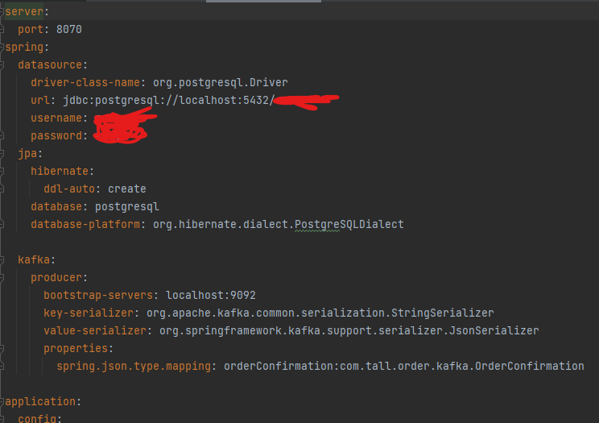

# Order Microservice

## Description

Le microservice **Order** est responsable de la gestion des commandes dans le système e-commerce. Il permet de créer, valider, et récupérer des informations sur les commandes des clients. Ce service communique avec d'autres microservices comme le microservice **Product** pour vérifier les produits et le microservice **Payment** pour traiter les paiements.

## Structure du Projet

Le projet est organisé en différents packages pour gérer les différentes fonctionnalités :

- **customer** : Contient les classes pour la gestion des interactions avec les clients, via `CustomerClient` et `CustomerResponse`.
- **exception** : Contient la gestion des exceptions avec `BusinessException`.
- **kafka** : Contient la configuration et la gestion des messages Kafka pour les confirmations de commande via `OrderProducer`, `OrderConfirmation`, et `KafkaOrderTopicConfig`.
- **mapper** : Convertit les objets de requêtes et réponses avec `OrderMapper`.
- **order** : Contient les entités principales comme `Order` et `PaymentMethod`.
- **orderline** : Gère les lignes de commande avec `OrderLine`, `OrderLineController`, et les classes associées (Mapper, Repository, etc.).
- **payment** : Gère les interactions avec le microservice de paiement via `PaymentClient` et `PaymentRequest`.
- **product** : Gère les interactions avec le microservice de produits via `ProductClient`, `PurchaseRequest`, et `PurchaseResponse`.
- **repository** : Interface `OrderRepository` pour interagir avec la base de données.
- **request** : Contient les objets de requête comme `OrderRequest`.
- **response** : Définit les objets de réponse comme `OrderResponse`.
- **service** : Contient la logique métier avec `OrderService`.
- **web** : Contient les contrôleurs web avec `OrderController` et le point d'entrée principal de l'application via `OrderApplication`.

## Technologies Utilisées

- **Java** : Langage principal utilisé pour le développement.
- **Spring Boot** : Framework pour la gestion des microservices.
- **Spring Data JPA** : Pour interagir avec la base de données.
- **Spring Cloud Netflix Eureka** : Pour la découverte de services.
- **Spring Cloud OpenFeign** : Pour communiquer avec d'autres microservices (Customer, Product, Payment).
- **Kafka** : Pour la gestion des événements liés aux commandes.
- **PostgreSQL** : Base de données relationnelle utilisée pour stocker les informations de commande.
- **Docker** : Pour conteneuriser l'application.

## Intégration de Spring Cloud OpenFeign

Le microservice **Order** utilise **Spring Cloud OpenFeign** pour communiquer avec d'autres microservices, notamment les microservices **Client** et **Product**. Cela permet au service de passer des appels HTTP aux autres services sans avoir besoin de gérer manuellement les requêtes HTTP, grâce à un client REST déclaratif.

### 1. Utilisation avec le microservice Customer

Le microservice **Order** doit interagir avec le microservice **Client** pour vérifier l'existence et les informations d'un client avant de créer une commande. Cela se fait en utilisant l'interface (voir package customer)
### 2. Utilisation avec le microservice Product
Le microservice **Order** doit interagir avec le microservice **Product** pour vérifier l'existence et les informations d'un produit avant de créer une commande. Cela se fait en utilisant l'interface (voir package product)
### 3. Utilisation avec le microservice Payment
Le microservice **Order** doit interagir avec le microservice **Payment** pour vérifier l'existence et les informations du payment avant de créer une commande. Cela se fait en utilisant l'interface (voir package customer)
## Intégration de Kafka pour la Gestion des Notifications
Le microservice Order utilise Kafka pour gérer les notifications liées aux commandes. Par exemple, une fois qu'une commande est créée et confirmée, une notification est envoyée au système pour informer que la commande a été traitée. Kafka permet de gérer cette communication de manière asynchrone et efficace.
(voir le package kafka)

## Noublier pas de creer le fichier yml pour configurer la base de donner

le fichier se trouve dans le microservice "serviceconfiguration"

## Endpoints API

- `POST /orders` : Créer une nouvelle commande.
- `GET /orders/{id}` : Récupérer une commande par son ID.
- `PUT /orders/{id}` : Mettre à jour une commande existante.
- `DELETE /orders/{id}` : Supprimer une commande.

### Exemple de requête pour créer une commande
```json
{
    "customerId": "123",
    "orderLines": [
        {
            "productId": "456",
            "quantity": 2
        }
    ],
    "paymentMethod": "CREDIT_CARD"
}
