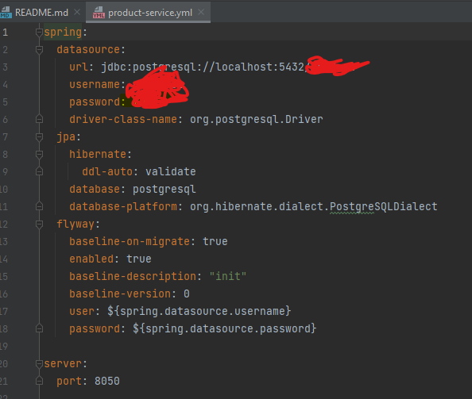

# Product Microservice

## Description

Le microservice **Product** est responsable de la gestion des produits dans le système e-commerce. Il permet de créer, mettre à jour, supprimer et récupérer des informations sur les produits. Ce service fait partie d'une architecture microservices et communique avec d'autres services comme les services de commande et de notification.

## Structure du Projet

Le projet est structuré de manière modulaire avec des packages distincts pour chaque composant :

- **exception** : Contient les exceptions spécifiques au microservice comme `ProductPurchaseException`.
- **handler** : Gère les exceptions globales via `GlobalExceptionHandler` et la réponse d'erreur est standardisée dans `ErrorResponse`.
- **mapper** : Utilisé pour convertir des objets de requêtes ou réponses avec `ProductMapper`.
- **product1** : Contient les entités de base comme `Product` et `Category`.
- **repository** : Interface `ProductRepository` pour interagir avec la base de données.
- **request** : Contient les objets de requête comme `ProductRequest` et `ProductPurchaseRequest`.
- **response** : Définit les objets de réponse comme `ProductResponse` et `ProductPurchaseResponse`.
- **service** : Contient la logique métier dans `ProductService`.
- **web** : Contient le point d'entrée principal de l'application avec `ProductApplication`.

## Technologies Utilisées

- **Java** : Langage principal pour le développement du microservice.
- **Spring Boot** : Framework utilisé pour simplifier le développement de microservices en Java.
- **Spring Data JPA** : Utilisé pour interagir avec la base de données.
- **PostgreSQL** : Base de données relationnelle utilisée pour stocker les informations sur les produits.
## Noublier pas de creer le fichier yml pour configurer la base de donner

le fichier se trouve dans le microservice "serviceconfiguration"

## Endpoints API

Voici quelques exemples d'API exposées par le microservice :

- `POST /products` : Créer un nouveau produit.
- `GET /products/{id}` : Récupérer un produit par son ID.
- `PUT /products/{id}` : Mettre à jour un produit existant.
- `DELETE /products/{id}` : Supprimer un produit.

### Exemple de requête pour créer un produit
```json
{
    "name": "Product Name",
    "description": "Product Description",
    "price": 100,
    "categoryId": 1
}
